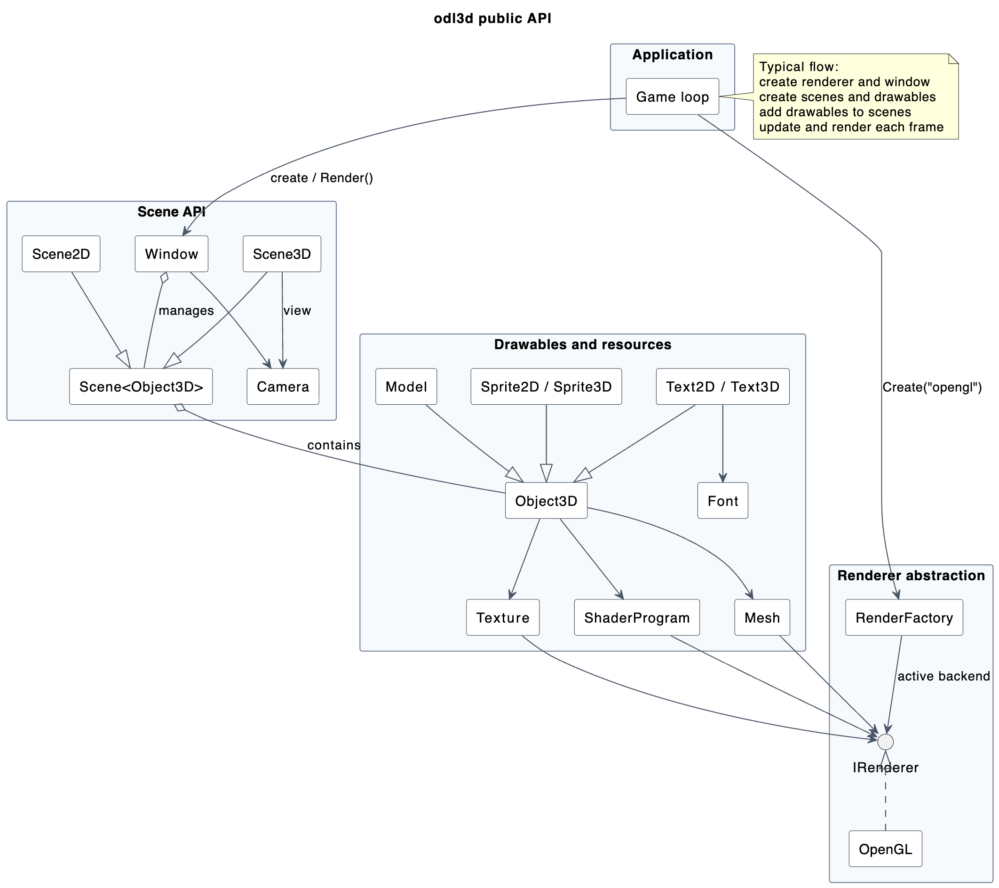

# odl3d - Object Display Layer 3D

A .NET 3D graphics library with an abstract renderer stack and GLFW-based windowing for cross-platform game development and graphics applications.

## Overview

odl3d is a C# graphics library designed to simplify 3D game development and graphics programming. It provides a unified API for handling 3D rendering, scene management, shaders, and asset management across Windows, Linux, and macOS.

## Architecture

Applications create a window and renderer, add drawable objects to 2D or 3D scenes, and render those scenes through the active backend.



## Dependencies

- **GLFW3** - Window management
- **Freetype** - Font rendering

## Building

```powershell
# Build odl3d
dotnet build

# Release build
dotnet build -c Release
```

## License

MIT License - See [LICENSE](LICENSE) file for details.

Copyright © 2026 Marijn Herrebout

## Getting Started

1. Clone the repository
2. Ensure the native dependencies for your selected renderer/backend are available in `bin`:
   * Windows: `freetype6.dll` and `glfw3.dll`
   * macOS: `libfreetype.6.dylib` and `libglfw.3.dylib`
   * Linux: `libfreetype.6.so` and `libglfw.3.so`
3. Build the project:
   ```powershell
   dotnet build
   ```
4. Run the demo or reference the library in your project

## Documentation

For detailed usage information, refer to the source files in the `src/` directory.