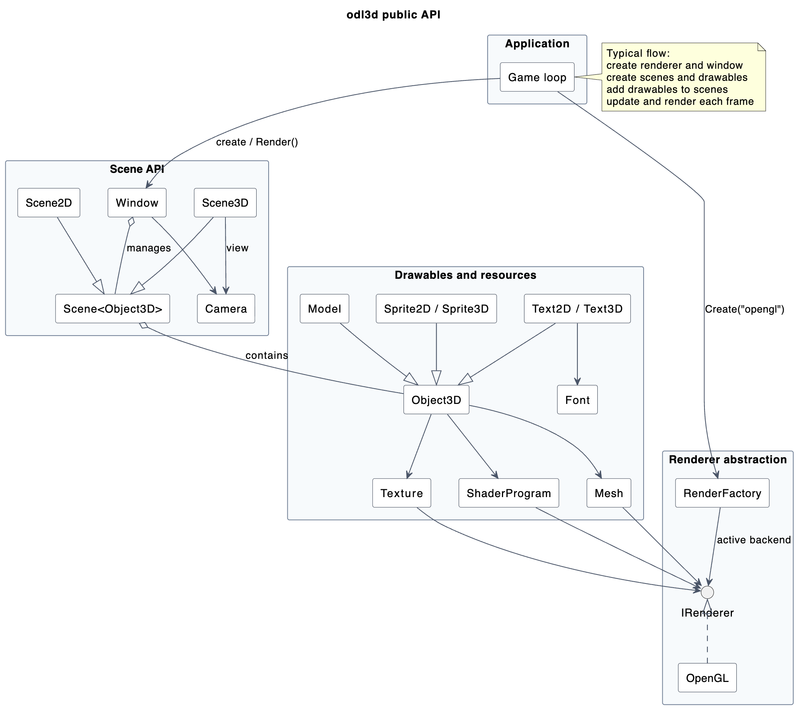

# odl3d - Object Display Layer 3D

A .NET 3D graphics library with an abstract renderer stack and GLFW-based windowing for cross-platform game development and graphics applications.

## Overview

odl3d is a C# graphics library designed to simplify 3D game development and graphics programming. It provides a unified API for handling 3D rendering, scene management, shaders, and asset management across Windows, Linux, and macOS.

## Architecture

Applications create a graphics application and window, construct drawables independently, explicitly add them to 2D or 3D scenes, and render those scenes through the application's renderer.

```csharp
using var app = new GraphicsApplication(RenderTarget.OpenGL);
using var window = app.CreateWindow(800, 600, "My application");
var scene = window.CreateScene3D();

var texture = TextureBuilder.CreateCheckerboard(64, 64, Color.Magenta, new Color(0, 255, 255));
var sprite = new Sprite3D(texture);
scene.Add(sprite);

while (!window.ShouldClose)
{
   window.Update(0);
   window.Render();
}
```



## Dependencies

- **GLFW3** - Window management
- **Freetype** - Font rendering

## Project Layout

- `odl3d.csproj` builds the reusable core library from `src/`.
- `demo/odl3d.Demo.csproj` builds the interactive sample and copies its assets.
- `tests/odl3d.Tests/odl3d.Tests.csproj` contains CPU-only unit tests and backend tests as they are added.
- `external/decodl` is the upstream decoder project, pinned as a Git submodule.

Default GLSL and MSL sources are kept as editable raw-string constants in `src/shaders/DefaultShaders.cs`; they are compiled directly from source and do not depend on demo files or the current working directory.

## Building

Clone with the decoder submodule, or initialize it after cloning:

```sh
git clone --recurse-submodules https://github.com/Marin-MK/odl3d.git
# Or, from an existing checkout:
git submodule update --init --recursive
```

Build the library and demo, or run the initial core tests:

```sh
dotnet build odl3d.sln
dotnet test tests/odl3d.Tests/odl3d.Tests.csproj
dotnet run --project demo/odl3d.Demo.csproj
```

## License

MIT License - See [LICENSE](LICENSE) file for details.

Copyright © 2026 Marijn Herrebout

## Getting Started

1. Ensure the native dependencies for your selected renderer/backend are available in `bin`:
   * Windows: `freetype6.dll` and `glfw3.dll`
   * macOS: `libfreetype.6.dylib` and `libglfw.3.dylib`
   * Linux: `libfreetype.6.so` and `libglfw.3.so`
3. Build the project:
   ```powershell
   dotnet build
   ```
4. Run the demo or reference the library in your project

## Documentation

For detailed usage information, refer to the source files in the `src/` directory.